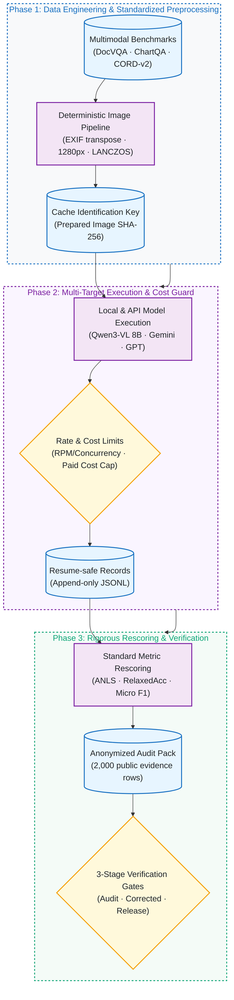
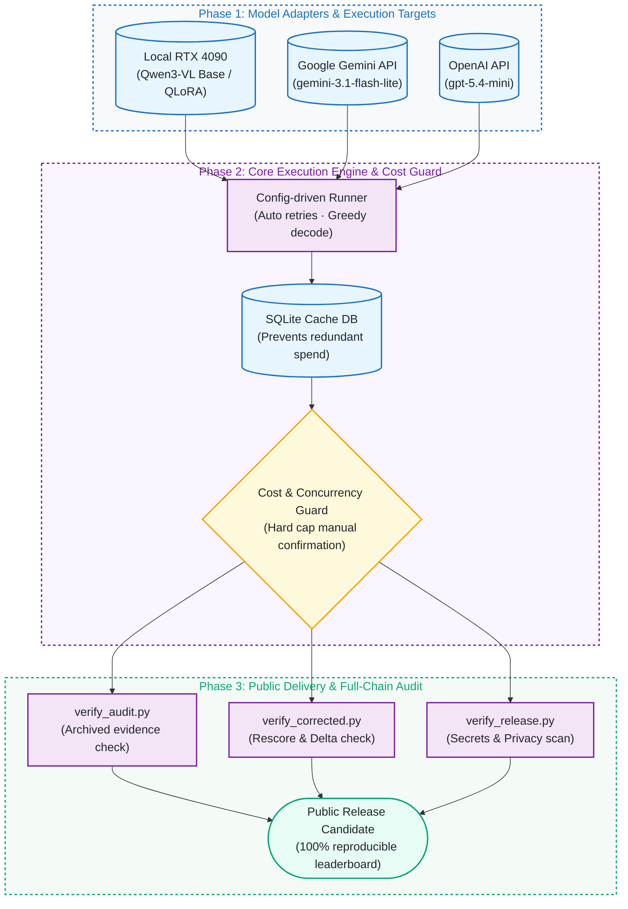

# vlm-eval-bench: Document Understanding VLM Evaluation & Auditable Benchmark

[](https://github.com/kuotunyu/vlm-eval-bench/actions/workflows/ci.yml)


[](LICENSE)

[繁體中文](README.md)

An auditable, config-driven harness for evaluating local and API vision-language models on document understanding tasks: controlling sampling, deterministic image preparation, greedy decoding, automated retries, SQLite caching, and paid API cost gates under one reproducible interface.

---

## System Architecture & Pipeline

### 1. Vision-Language Model Evaluation & Audit Pipeline



### 2. Evaluation System Architecture & Gate Protection



---

## Corrected results

Offline rescore of the unchanged 2026-07-10 predictions · seed 3407 · DocVQA n=200 · ChartQA n=200 · CORD-v2 n=100:

| Model | DocVQA ANLS | ChartQA RelaxedAcc | CORD-v2 F1 | Avg |
|---|---:|---:|---:|---:|
| **qwen3vl-8b-receipt-qlora** (local, fine-tuned) | 0.9188 [0.8823, 0.9507] | 0.8300 [0.7750, 0.8800] | **0.9234 [0.8915, 0.9500]** | **0.8907** |
| qwen3vl-8b-base (local) | **0.9316 [0.8967, 0.9608]** | 0.8300 [0.7750, 0.8800] | 0.7423 [0.7037, 0.7719] | 0.8346 |
| gemini-3.1-flash-lite | 0.8795 [0.8361, 0.9180] | 0.3750 [0.3150, 0.4400] | 0.8701 [0.8460, 0.8928] | 0.7082 |
| gpt-5.4-mini | 0.8546 [0.8069, 0.8974] | 0.2900 [0.2300, 0.3550] | 0.8193 [0.7892, 0.8469] | 0.6546 |

Key takeaways:
- **Specialized Adaptation:** The receipt QLoRA achieved a substantial in-domain gain on CORD (**+0.181** F1) over the 8B base model while preserving out-of-domain performance on DocVQA (-0.013) and ChartQA (0.000).
- **Rigorous Metric Correction:** The release rescored frozen predictions using space-sensitive DocVQA ANLS and Pix2Struct-compatible ChartQA relaxed accuracy. Historical values remain preserved in the [archived leaderboard](results/archived_leaderboard.md), and delta analysis is documented in the [corrected leaderboard](results/leaderboard.md).

---

## Models and Tasks

| Model | Provider / Environment | Benchmark Role |
|---|---|---|
| `unsloth/Qwen3-VL-8B-Instruct-unsloth-bnb-4bit` | Local RTX 4090 | 4-bit baseline |
| receipt QLoRA adapter | Local RTX 4090 | CORD-v2 fine-tuned comparison |
| `gemini-3.1-flash-lite` | Google Cloud API | Cloud lightweight multimodal reference |
| `gpt-5.4-mini` | OpenAI API | Cloud small multimodal reference |

| Task | Dataset / Split | Sample Size | Metric |
|---|---|---:|---|
| DocVQA | `lmms-lab/DocVQA`, validation | 200 | ANLS (Average Normalized Levenshtein Similarity) |
| ChartQA | `HuggingFaceM4/ChartQA`, test | 100 human + 100 synthetic | Relaxed Accuracy (5% tolerance) |
| CORD-v2 | `naver-clova-ix/cord-v2`, test | all 100 | Field-level Micro F1 |

---

## Verify and Reproduce

Verify claims offline (CPU-only, no GPUs, datasets, or API calls required):

```bash
uv sync --locked
uv run python scripts/verify_audit.py
uv run python scripts/verify_corrected.py
uv run python scripts/verify_release.py
```

`verify_corrected.py` verifies all SHA-256 chains across 2,000 privacy-reduced rows, independently recomputes DocVQA and ChartQA confidence intervals, and confirms leaderboard integrity.

---

## Method & Engineering Controls

- **Committed Sampling Seeds:** Seed 3407 index manifests ensure exact input alignment across all tested models.
- **Deterministic Image Pipeline:** EXIF transposition, RGB conversion, 1,280 px max edge, LANCZOS resizing, and JPEG 90; processed image SHA-256 is part of the cache key.
- **Greedy Decoding:** Zero-temperature sampling minimizes provider-side variance.
- **Cost & Concurrency Controls:** Enforced RPM/concurrency bounds, resume-safe JSONL, and a hard API cost gate.

---

## Data and licensing

- Code: [MIT License](LICENSE).
- Third-party dataset terms and evidence boundaries are detailed in [EVALUATION_CARD.md](EVALUATION_CARD.md).
