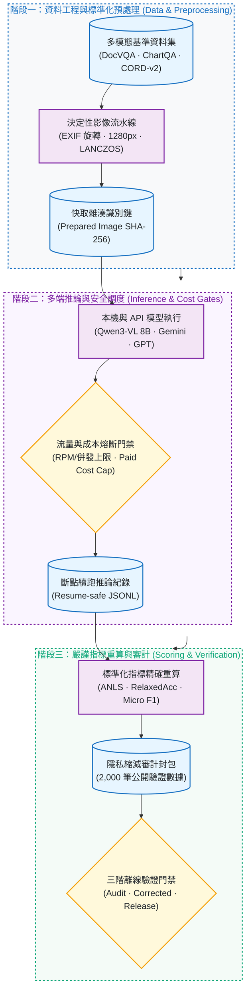
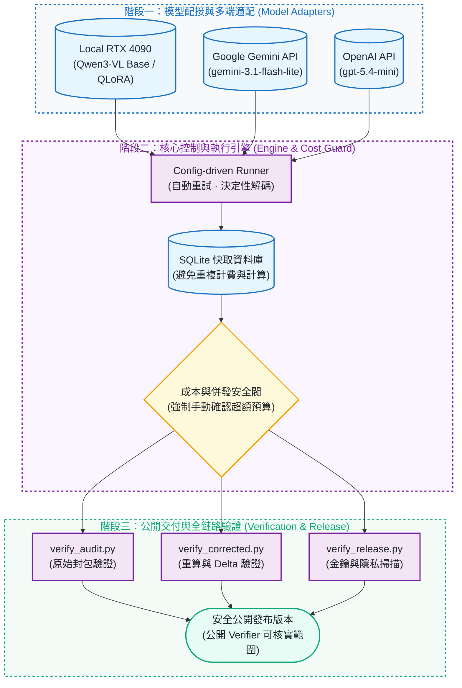

# vlm-eval-bench：視覺語言模型文件理解評測與可審計基準

[](https://github.com/kuotunyu/vlm-eval-bench/actions/workflows/ci.yml)


[](LICENSE)

[English](README.en.md)

本專案為針對文件理解任務打造的可審計（Auditable）、配置驅動視覺語言模型（VLM）評測框架：統一控制資料取樣、影像標準化預處理、決定性解碼、API 自動重試、SQLite 快取與付費成本熔斷門禁，並提供 2,000 筆隱私縮減（privacy-reduced）公開驗證封包與完整離線重算鏈路。

---

## 系統架構與 Pipeline

### 1. 視覺語言模型評測與審計 Pipeline



### 2. 評測系統架構與防護門禁



---

## Corrected results

基於 2026-07-10 凍結預測之離線重算結果 · seed 3407 · DocVQA n=200 · ChartQA n=200 · CORD-v2 n=100：

| Model | DocVQA ANLS | ChartQA RelaxedAcc | CORD-v2 F1 | Avg |
|---|---:|---:|---:|---:|
| **qwen3vl-8b-receipt-qlora** (local, fine-tuned) | 0.9188 [0.8823, 0.9507] | 0.8300 [0.7750, 0.8800] | **0.9234 [0.8915, 0.9500]** | **0.8907** |
| qwen3vl-8b-base (local) | **0.9316 [0.8967, 0.9608]** | 0.8300 [0.7750, 0.8800] | 0.7423 [0.7037, 0.7719] | 0.8346 |
| gemini-3.1-flash-lite | 0.8795 [0.8361, 0.9180] | 0.3750 [0.3150, 0.4400] | 0.8701 [0.8460, 0.8928] | 0.7082 |
| gpt-5.4-mini | 0.8546 [0.8069, 0.8974] | 0.2900 [0.2300, 0.3550] | 0.8193 [0.7892, 0.8469] | 0.6546 |

核心工程發現：
- **領域微調效益：** 收據專用 QLoRA 相較同一 8B Base 模型，在其訓練域 CORD 觀察到 in-domain 增益（**+0.181** F1，為觀察值，未經正式 paired significance 檢定）。DocVQA（-0.013）與 ChartQA（0.000）僅為兩項有限的 out-of-domain 實測結果，不代表廣泛能力提升。
- **嚴謹計分修正：** 本次發布不重跑推論，而是依 corrected metric contract（space-sensitive DocVQA ANLS、Pix2Struct 相容之 ChartQA Relaxed Correctness）對原始凍結預測重新計分；CORD-v2 F1 演算法未變。舊版數據完整保留於 [archived leaderboard](results/archived_leaderboard.md)，差異比對詳見 [corrected leaderboard](results/leaderboard.md)。

---

## 模型與評測任務

| 模型 | 提供商 / 環境 | 評測角色 |
|---|---|---|
| `unsloth/Qwen3-VL-8B-Instruct-unsloth-bnb-4bit` | 本地 RTX 4090 | 4-bit 基準模型 |
| receipt QLoRA adapter | 本地 RTX 4090 | CORD-v2 微調對照組 |
| `gemini-3.1-flash-lite` | Google Cloud API | 雲端輕量多模態代表 |
| `gpt-5.4-mini` | OpenAI API | 雲端小型多模態代表 |

| 任務 | 資料集與切分 | 樣本數 | 評測指標 |
|---|---|---:|---|
| DocVQA | `lmms-lab/DocVQA`, validation | 200 | ANLS (Average Normalized Levenshtein Similarity) |
| ChartQA | `HuggingFaceM4/ChartQA`, test | 100 人工 + 100 機構圖 | Relaxed Accuracy (5% 容差) |
| CORD-v2 | `naver-clova-ix/cord-v2`, test | 全部 100 筆 | Field-level Micro F1 |

---

## 驗證與重現

本機離線驗證（不需 GPU、不需下載原始資料集或呼叫 API）：

```bash
uv sync --locked
uv run python scripts/verify_audit.py
uv run python scripts/verify_corrected.py
uv run python scripts/verify_release.py
```

`verify_corrected.py` 將自動校驗 2,000 筆隱私縮減公開列之雜湊鏈、重新計算 DocVQA 與 ChartQA 信賴區間，並嚴格核對所有宣稱與排行榜數值。

**公開／私有證據邊界：** 公開封包只含 sample ID、分數、usage、cost、latency 與 error 狀態等純量欄位，**不含**題目、圖片、references、model answers、raw predictions 或 provider 原始回應；`data/samples/` 下僅公開整數索引。CORD-v2 的 references／predictions 刻意排除在外，其 F1 僅能做 **provenance 驗證**（雜湊與列數逐一比對），無法在公開範圍內獨立重算；可獨立重算的部分是 DocVQA／ChartQA 的均值與信賴區間。

---

## 分數為何改變

- **DocVQA：** 舊版計分會壓縮答案內部空白，且在標準化 Levenshtein 距離「恰好等於 0.5」時仍視為通過；新版依 corrected metric contract，大小寫不敏感但空白敏感，且距離必須「嚴格小於 0.5」。
- **ChartQA：** 舊版只是移除 `%` 符號、未換算為比例，且會移除貨幣與千分位符號；新版依 Pix2Struct 行為，`%` 會換算為比例後再套用 5% 相對容差，非數值目標則採大小寫不敏感的精確比對。
- **CORD-v2：** 計分演算法（corpus-level field micro F1）未變，所有 CORD 聚合值與逐列分數與舊版完全相同。

API 端 ChartQA 分數下降是計分修正所致，**不是** provider 行為改變或重新呼叫模型的結果——所有比較都基於同一批凍結預測。完整證據邊界見 [EVALUATION_CARD.md](EVALUATION_CARD.md)。

---

## 方法與工程控制

- **凍結取樣索引：** 透過 `seed 3407` 索引清單確保所有受測模型輸入完全一致。
- **統一影像預處理：** EXIF 自動旋轉、RGB 轉換、長邊上限 1,280 px、LANCZOS 縮放與 JPEG quality 90；預處理後影像 SHA-256 納入快取雜湊鍵。
- **溫度零決定性解碼：** 統一設定 `temperature=0`，最小化 provider 內部隨機性。
- **安全防護與成本熔斷：** 內建各提供商 RPM/併發限制、斷點續跑 JSONL，付費 API 超額前強制終止或要求手動確認。

---

## 成本與延遲注意事項

- 所有 cost/usage/latency 會計數據均**沿用歷史推論當時的紀錄，未重新計算**。API 費用是依 provider 回傳的 usage 與當時 config 內設定的價格估算，**未對過發票**；歷史 OpenAI 設定曾對 image token 另計比例，僅作為 provenance 保留，並非目前計費依據。
- Config 內的 provider 價格／配額／模型別名僅供估算，**不是目前的計費承諾**；執行任何新的付費評測前，請自行重新確認當前價格與配額。
- 本地端費用是依測得推論時間換算的 RTX 4090 租賃等價金額（非實際付款）；本地 batch-1 延遲**未計入網路時間**，與 API 的 round-trip 延遲**不可直接比較**。
- 0% error rate 僅涵蓋最終去重後的紀錄，不代表過程中沒有被重試過的暫時性失敗。

---

## 資料與授權

- 本專案程式碼採 [MIT License](LICENSE) 授權；第三方資料集授權與各 API 提供商條款各自獨立，**不隨本專案授權轉移**，下載或使用前請自行確認。
- 完整評測邊界、可公開重算範圍與聲明請見 [EVALUATION_CARD.md](EVALUATION_CARD.md)。
