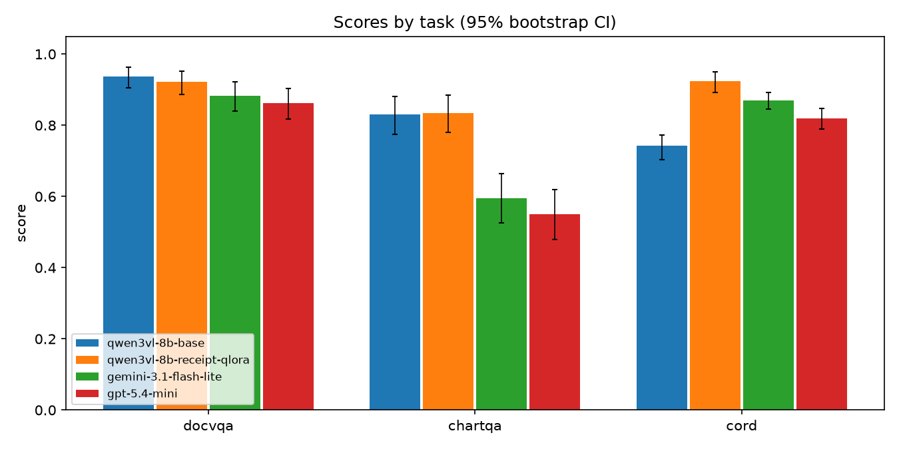
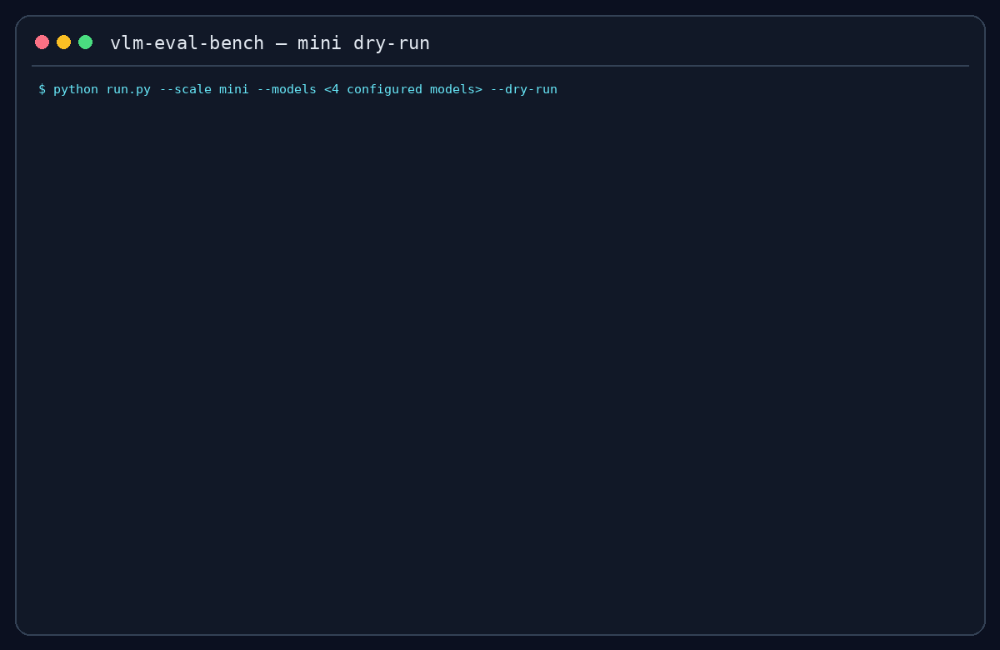

# vlm-eval-bench

Config-driven VLM evaluation harness comparing a **locally fine-tuned Qwen3-VL-8B**
(QLoRA adapter from [vlm-receipt-extractor](https://huggingface.co/steven0226/vlm-receipt-extractor))
against **commercial lightweight API models** on document-understanding tasks — scored on
accuracy, latency, and cost, from a single `config.yaml`.

Results live in [results/leaderboard.md](results/leaderboard.md).

## Results (v1, 2026-07-10)

| Model | DocVQA ANLS | ChartQA RelaxedAcc | CORD-v2 F1 | Avg |
|---|---|---|---|---|
| **qwen3vl-8b-receipt-qlora** (local, fine-tuned) | 0.921 | 0.835 | **0.923** | **0.893** |
| qwen3vl-8b-base (local) | **0.937** | 0.830 | 0.742 | 0.836 |
| gemini-3.1-flash-lite | 0.882 | 0.595 | 0.870 | 0.782 |
| gpt-5.4-mini | 0.862 | 0.550 | 0.819 | 0.744 |

**Core result:** receipt QLoRA changes CORD by **+0.181**, DocVQA by
**-0.015**, and ChartQA by **+0.005** versus the same 8B base model.

DocVQA n=200 / ChartQA n=200 / CORD n=100, seed 3407, 0% error rate for all models.
Per-score 95% CIs, cost/latency tables, and per-model error cases: [results/leaderboard.md](results/leaderboard.md).






The GIF is generated from a real `run.py --scale mini --dry-run` transcript. It
exercises dataset loading, deterministic sample selection, cache inspection, and
the pre-run cost gate without spending API credit; regenerate it with
`uv run python scripts/render_demo_gif.py`.

## Models

| Model | Provider | Notes |
|---|---|---|
| `unsloth/Qwen3-VL-8B-Instruct-unsloth-bnb-4bit` | local (RTX 4090) | zero-shot baseline, 4-bit |
| `steven0226/vlm-receipt-extractor` | local (RTX 4090) | QLoRA adapter fine-tuned on CORD-v2 train |
| `gemini-3.1-flash-lite` | Google | thinking_level=minimal |
| `gpt-5.4-mini` | OpenAI | reasoning effort=none |
| `claude-haiku-4-5` | Anthropic | provider implemented; disabled in config pending API billing |

Models are added/removed/priced in `config.yaml`; prices in the config comments were
verified against each provider's official pricing page (2026-07-09).

## Tasks & metrics

| Task | Dataset | Sample | Metric |
|---|---|---|---|
| DocVQA | `lmms-lab/DocVQA` validation (5,349) | 200, seed 3407 | **ANLS** (threshold 0.5) |
| ChartQA | `HuggingFaceM4/ChartQA` test (2,500) | 100 human + 100 machine, stratified | **relaxed accuracy** (5% numeric tolerance) |
| CORD-v2 | `naver-clova-ix/cord-v2` test | all 100 | **field-level micro F1** |

**Why these metrics.** Each is the standard metric of its benchmark, so numbers are
comparable to published results: ANLS tolerates OCR-ish near-misses via normalized
Levenshtein similarity; relaxed accuracy tolerates 5% numeric error, matching how chart
values are read in practice; field-level F1 measures structured extraction the way it
fails in production (per-field, with one-to-one line-item alignment), reusing the exact
comparator from the fine-tuning project so before/after numbers are apples-to-apples.

**Sampling.** The full-scale question list is drawn once per task with seed 3407 and
committed to `data/samples/`, so runs are reproducible. The mini scale (20/task) is a
*prefix* of the full list — scaling up reuses every cached mini response. ChartQA is
stratified 50/50 human/machine and interleaved so any prefix stays balanced. The same
question set goes to every model.

## Fairness notes

- **Identical inputs**: one prompt per task, byte-identical for every model; identical
  image preparation (EXIF-transpose, RGB, ≤1280px LANCZOS, JPEG q90) — the same bytes go
  to the local model and every API.
- **Decoding aligned**: temperature 0 / greedy everywhere; reasoning minimized
  (`reasoning.effort=none` for OpenAI, `thinking_level=minimal` for Gemini 3.x — it
  cannot be fully disabled; thought tokens are counted and billed as output).
- **Answer post-processing identical**: strip fences/quotes, first non-empty line, drop
  a leading "Answer:" and one trailing period — the same function for all models.
- **Cost is billed usage, not estimates**: token counts come from each API's returned
  usage. Two disclosed approximations: (1) OpenAI usage does not split image vs text
  input tokens, so the image share is computed with the documented patch formula
  (`ceil(w/32)·ceil(h/32)`, cap 1536, ×1.62 for the mini family) and billed at the image
  rate; (2) local-model "cost" is *imputed* as RTX 4090 cloud-rental rate ($0.35/hr) ×
  measured inference wall time, and flagged wherever it appears.
- **Latency caveat**: local latency (batch=1, no network, consumer GPU) is not
  comparable to API round-trip latency; tables flag it.
- **In-domain by design**: the QLoRA model was fine-tuned on CORD-v2 train — CORD is its
  home turf (that's the story being measured). DocVQA/ChartQA double as a
  catastrophic-forgetting check against the base model.
- **Uncertainty**: every score carries a 95% percentile-bootstrap CI (n=2000, seeded).
  Errors after retries score 0 and are reported separately as an error rate; failed
  calls are never cached, so reruns retry them.

## Reproduce

```bash
# inside WSL (Windows 11 + WSL2 Ubuntu, RTX 4090 for local models)
export UV_PROJECT_ENVIRONMENT="$HOME/.venvs/vlm-eval-bench"
uv sync                      # API-only
uv sync --extra local        # + local GPU inference (unsloth/torch)

# Create the gitignored local environment file, then fill only the providers used:
cp .env.example .env
# GOOGLE_API_KEY or GEMINI_API_KEY / OPENAI_API_KEY / ANTHROPIC_API_KEY (HF_TOKEN optional)

uv run pytest                                   # metric + infra unit tests
uv run ruff check .                             # static quality gate (also runs in CI)
uv run python run.py --scale mini --dry-run     # sampling + cost estimate, zero API calls
uv run python run.py --scale mini               # 20 questions/task, prints full-scale extrapolation
uv run python run.py --scale full               # gated by the $10 cost cap in config.yaml
uv run python report.py                         # regenerate results/leaderboard.md + charts
```

Every response is cached in SQLite (`results/cache.sqlite`); reruns never re-hit APIs.
Runs are resume-safe: interrupted (model, task) files pick up where they left off.

### Audit the published numbers without an API or dataset download

The committed [audit pack](results/audit/README.md) contains 2,000 deduplicated
result rows for the four complete models, with SHA-256 provenance and no dataset
images, questions, prompts, or references. From a fresh clone:

```bash
uv sync --locked                 # API/core only; does not install the local GPU extra
uv run python scripts/verify_audit.py
```

This verifies file hashes, deterministic row counts, costs, usage, latency summaries,
and the score/cost/token values in `results/leaderboard.md`. DocVQA and ChartQA scores
are independently recomputed from the pack. CORD uses reference-dependent corpus-level
micro F1, so its aggregate is provenance-checked rather than falsely described as
independently rescored. Maintainers with the ignored raw predictions can reproduce the
pack with `uv run python scripts/build_audit_pack.py`.

## Harness design

```
config.yaml ─→ tasks (sampled via committed manifests) ─→ runner
models: one async interface (BaseModel.generate) for local + API
        per-provider concurrency + RPM limits, retry w/ backoff
        SQLite response cache keyed on (model, task, sample, prompt, gen+image params)
cost:   pre-run estimate gate (default $10 cap) → mid-run CostMeter kill-switch
output: results/predictions/*.jsonl → leaderboard.md + charts (deterministic)
```

Validation: the ANLS / relaxed-accuracy / F1 implementations are unit-tested against
hand-computed cases, and the CORD pipeline is anchored against the fine-tuning project's
originally reported results (base 0.744 / fine-tuned 0.930 overall F1).

## Dataset licenses & attribution

- [DocVQA](https://huggingface.co/datasets/lmms-lab/DocVQA) (UCSF Industry Documents; see dataset card)
- [ChartQA](https://huggingface.co/datasets/HuggingFaceM4/ChartQA) (GPL-3.0 per dataset card)
- [CORD-v2](https://huggingface.co/datasets/naver-clova-ix/cord-v2) (CC BY 4.0, Naver Clova)
- CORD schema/comparator vendored from the author's
  [vlm-receipt-extractor](https://huggingface.co/steven0226/vlm-receipt-extractor) project (MIT)

## Analysis

The fine-tuned `qwen3vl-8b-receipt-qlora` is the overall leader at **0.893**
average across the three tasks. That average is only a navigation aid: the
task-level scores and confidence intervals are the real comparison because
DocVQA, ChartQA, and CORD measure different behaviors.

The adapter's gain is deliberately narrow. Relative to the same 8B base model,
CORD-v2 F1 improves by **+0.181**, while DocVQA changes by **−0.015** and
ChartQA by **+0.005**. In other words, receipt fine-tuning produced a large
in-domain benefit without evidence of broad improvement—or material
catastrophic forgetting—on these two out-of-domain samples.

Among the measured APIs, `gemini-3.1-flash-lite` has both the strongest average
(**0.782**) and the lowest observed cost (**$0.0346 per 100 questions**).
The local dollar figures are imputed RTX 4090 rental costs rather than bills,
and local batch-1 latency excludes network time, so neither should be compared
to API price or round-trip latency without those qualifications.

All four complete runs finished with a **0.00%** error rate. The result still
describes fixed, seeded samples—200 DocVQA, 200 ChartQA, and 100 CORD—not
production traffic. The generated [leaderboard](results/leaderboard.md) keeps
these caveats beside the confidence intervals, cost, latency, and error cases.
