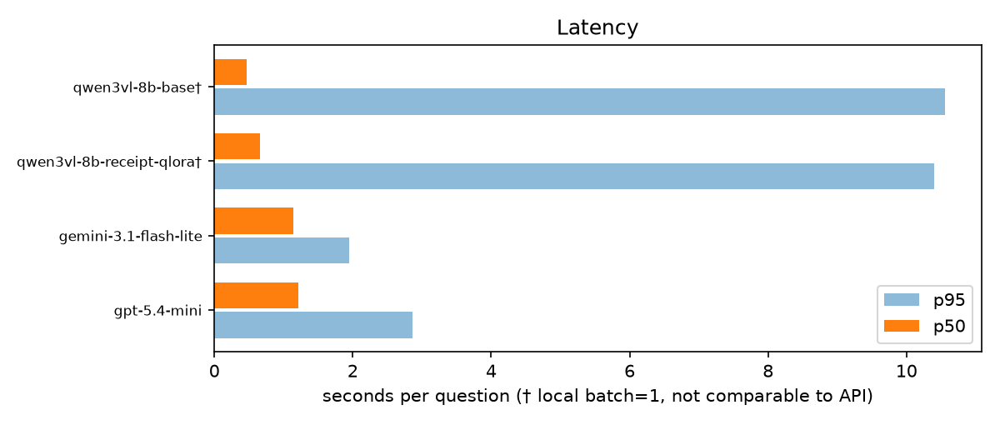
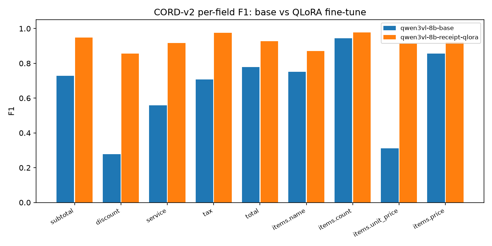

# vlm-eval-bench — Leaderboard

Seed 3407 · docvqa n=200, chartqa n=200, cord n=100 · greedy decoding · identical prompts/images for all models
· 95% CI via percentile bootstrap (n=2000)

## Scores

| Model | DocVQA ANLS | ChartQA RelaxedAcc | CORD-v2 F1 | Avg |
|---|---|---|---|---|
| qwen3vl-8b-base† | 0.937 [0.905, 0.964] | 0.830 [0.775, 0.880] | 0.742 [0.704, 0.772] | 0.836 |
| qwen3vl-8b-receipt-qlora† | 0.921 [0.887, 0.952] | 0.835 [0.780, 0.885] | 0.923 [0.891, 0.950] | 0.893 |
| gemini-3.1-flash-lite | 0.882 [0.840, 0.921] | 0.595 [0.525, 0.665] | 0.870 [0.846, 0.893] | 0.782 |
| gpt-5.4-mini | 0.862 [0.817, 0.903] | 0.550 [0.480, 0.620] | 0.819 [0.789, 0.847] | 0.744 |

ChartQA split: qwen3vl-8b-base human=0.71 machine=0.95 · qwen3vl-8b-receipt-qlora human=0.72 machine=0.95 · gemini-3.1-flash-lite human=0.65 machine=0.54 · gpt-5.4-mini human=0.6 machine=0.5

† local model on RTX 4090 (WSL2), 4-bit, batch=1.

## Cost

| Model | Total $ | $/100 questions | Input tokens | Output tokens |
|---|---|---|---|---|
| qwen3vl-8b-base† | 0.1207† | 0.0241† | 436,373 | 19,455 |
| qwen3vl-8b-receipt-qlora† | 0.1194† | 0.0239† | 436,373 | 13,371 |
| gemini-3.1-flash-lite | 0.1731 | 0.0346 | 565,626 | 21,149 |
| gpt-5.4-mini | 0.4810 | 0.0962 | 527,260 | 13,151 |

† local cost is *imputed*: RTX 4090 cloud-rental rate ($0.35/hr) × measured inference wall time — not an API bill. Local token counts come from the tokenizer, not billed usage. OpenAI image/text input-token split is approximated with the documented patch formula.

## Latency (seconds per question, uncached calls only)

| Model | Task | Mean | p50 | p95 |
|---|---|---|---|---|
| qwen3vl-8b-base† | docvqa | 0.85 | 0.55 | 1.02 |
| qwen3vl-8b-base† | chartqa | 0.32 | 0.32 | 0.49 |
| qwen3vl-8b-base† | cord | 9.53 | 7.56 | 23.17 |
| qwen3vl-8b-receipt-qlora† | docvqa | 0.95 | 0.74 | 1.54 |
| qwen3vl-8b-receipt-qlora† | chartqa | 0.52 | 0.50 | 0.76 |
| qwen3vl-8b-receipt-qlora† | cord | 9.34 | 7.56 | 21.53 |
| gemini-3.1-flash-lite | docvqa | 1.26 | 1.17 | 1.65 |
| gemini-3.1-flash-lite | chartqa | 1.07 | 1.03 | 1.32 |
| gemini-3.1-flash-lite | cord | 1.71 | 1.60 | 2.41 |
| gpt-5.4-mini | docvqa | 1.52 | 1.24 | 3.08 |
| gpt-5.4-mini | chartqa | 1.25 | 1.08 | 2.77 |
| gpt-5.4-mini | cord | 1.63 | 1.47 | 2.62 |

† local latency (batch=1, no network) is **not comparable** to API round-trip latency.

## Reliability

| Model | Error rate | CORD valid-JSON rate |
|---|---|---|
| qwen3vl-8b-base | 0.00% | 100.00% |
| qwen3vl-8b-receipt-qlora | 0.00% | 100.00% |
| gemini-3.1-flash-lite | 0.00% | 100.00% |
| gpt-5.4-mini | 0.00% | 100.00% |

## Representative error cases

Lowest-scoring samples per model × task (deterministic: score asc, sample_id asc).

### qwen3vl-8b-base × docvqa

- `docvqa_38856` (score 0.00)
  - Q: What is the table number mentioned at the top of the page
  - expected: `['4']`
  - got: `TABLE 4`
- `docvqa_39069` (score 0.00)
  - Q: what are the four kinds of sandwiches are mentioned in the advertisement?
  - expected: `['Round ones, square ones, fat ones and lean ones', 'round ones, square ones, fat ones and lean ones.']`
  - got: `round, square, fat, lean`
- `docvqa_45480` (score 0.00)
  - Q: Which place Louis V.Place jr. from?
  - expected: `['HB']`
  - got: `New York, N.Y`

### qwen3vl-8b-base × chartqa

- `chartqa_1019` (score 0.00)
  - Q: which attitude represent the smallest gap between women and men?
  - expected: `I don't discriminate against them, nor do I fear them.`
  - got: `I don't discriminate against them, nor do I fear them`
- `chartqa_1041` (score 0.00)
  - Q: Which department has the biggest gender difference?
  - expected: `Tech`
  - got: `Non-tech`
- `chartqa_1054` (score 0.00)
  - Q: What color changed the most in Google advertising metrics for medical advertisers as a result of coronavirus pandemic in the United States as of March 2020?
  - expected: `Navy blue`
  - got: `Blue`

### qwen3vl-8b-base × cord

- `cord_0005` (score 0.17)
  - Q: Extract all information from this receipt image and return it as a JSON object with exactly this structure:
  - expected: `{'items': [{'name': 'TRAD KY TOAST CARTE', 'count': None, 'unit_price': None, 'price': 28182}], 'subtotal': 28182, 'discount': None, 'service': None, 'tax': 2818, 'total': 31000}`
  - got: `{
  "items": [
    {
      "name": "TRAD KY TOAST CARTE",
      "count": 1,
      "unit_price": 28.182,
      "price": 28.182
    }
  ],
  "subtotal": 28.182,
  "discount": null,
  "service": null,
  `
- `cord_0076` (score 0.17)
  - Q: Extract all information from this receipt image and return it as a JSON object with exactly this structure:
  - expected: `{'items': [{'name': 'BASO TAHU', 'count': None, 'unit_price': None, 'price': 46000}, {'name': 'NASI PUTIH', 'count': None, 'unit_price': None, 'price': 6000}, {'name': 'BASO TAHU', 'count': None, 'uni…`
  - got: `{
  "items": [
    {
      "name": "BASO TAHU",
      "count": 2,
      "unit_price": 46000,
      "price": 92000
    },
    {
      "name": "NASI PUTIH",
      "count": 2,
      "unit_price": 6000,
 `
- `cord_0067` (score 0.18)
  - Q: Extract all information from this receipt image and return it as a JSON object with exactly this structure:
  - expected: `{'items': [{'name': 'CHEESE JOHN', 'count': 1, 'unit_price': 950000, 'price': 950000}], 'subtotal': None, 'discount': None, 'service': None, 'tax': None, 'total': 950000}`
  - got: `{
  "items": [
    {
      "name": "2005-CHEESE JOHN",
      "count": 1,
      "unit_price": 9500,
      "price": 9500
    }
  ],
  "subtotal": 9500,
  "discount": null,
  "service": null,
  "tax": nu`

### qwen3vl-8b-receipt-qlora × docvqa

- `docvqa_45480` (score 0.00)
  - Q: Which place Louis V.Place jr. from?
  - expected: `['HB']`
  - got: `New York, N.Y`
- `docvqa_58789` (score 0.00)
  - Q: How many copies of ‘Sponsor’s letter evaluating the nominee’s research ‘ form sent to AIN 2/2/82?
  - expected: `['8']`
  - got: `8 copies`
- `docvqa_59292` (score 0.00)
  - Q: Who is receiving the highest 'total' remuneration?
  - expected: `['Shri. Viney Mehra', 'Shri Viney Mehra']`
  - got: `Shri V. K. Bhandari`

### qwen3vl-8b-receipt-qlora × chartqa

- `chartqa_1019` (score 0.00)
  - Q: which attitude represent the smallest gap between women and men?
  - expected: `I don't discriminate against them, nor do I fear them.`
  - got: `It's natural. I understand that homosexuals want to find love`
- `chartqa_1041` (score 0.00)
  - Q: Which department has the biggest gender difference?
  - expected: `Tech`
  - got: `Non-tech`
- `chartqa_1054` (score 0.00)
  - Q: What color changed the most in Google advertising metrics for medical advertisers as a result of coronavirus pandemic in the United States as of March 2020?
  - expected: `Navy blue`
  - got: `Search ad clicks`

### qwen3vl-8b-receipt-qlora × cord

- `cord_0041` (score 0.39)
  - Q: Extract all information from this receipt image and return it as a JSON object with exactly this structure:
  - expected: `{'items': [{'name': 'Chicken Maryland', 'count': None, 'unit_price': None, 'price': 47619}, {'name': 'Cappucino (Hot/Iced)', 'count': None, 'unit_price': None, 'price': 30303}, {'name': 'Naga Lychee J…`
  - got: `{"items":[{"name":"Chicken Maryland","count":null,"unit_price":null,"price":4761900},{"name":"Cappucino (Hot/Iced)","count":null,"unit_price":null,"price":3030300},{"name":"Naga Lychee Juice","count":`
- `cord_0071` (score 0.44)
  - Q: Extract all information from this receipt image and return it as a JSON object with exactly this structure:
  - expected: `{'items': [{'name': 'Cuka Apel Tetes', 'count': 1, 'unit_price': 198000, 'price': 198000}], 'subtotal': None, 'discount': None, 'service': None, 'tax': None, 'total': 198000}`
  - got: `{"items":[{"name":"Cuka Apel Tefes 1","count":null,"unit_price":198000,"price":198000}],"subtotal":198000,"discount":null,"service":null,"tax":null,"total":null}`
- `cord_0043` (score 0.62)
  - Q: Extract all information from this receipt image and return it as a JSON object with exactly this structure:
  - expected: `{'items': [{'name': 'Cheese Tart', 'count': 6, 'unit_price': None, 'price': 165000}, {'name': 'Box of 6', 'count': None, 'unit_price': None, 'price': None}, {'name': 'PP Carrier', 'count': None, 'unit…`
  - got: `{"items":[{"name":"Cheese Tart","count":6,"unit_price":null,"price":165000},{"name":"Box of 6","count":null,"unit_price":null,"price":null},{"name":"PP Carrier","count":null,"unit_price":null,"price":`

### gemini-3.1-flash-lite × docvqa

- `docvqa_38856` (score 0.00)
  - Q: What is the table number mentioned at the top of the page
  - expected: `['4']`
  - got: `Table 4`
- `docvqa_44841` (score 0.00)
  - Q: Which product shows a higher percentage of 'extremely ' likely usage when compared to 'very ' likely usage;  UXL or Marathon ?
  - expected: `['MARATHON', 'Marathon']`
  - got: `Ultamet XL`
- `docvqa_45480` (score 0.00)
  - Q: Which place Louis V.Place jr. from?
  - expected: `['HB']`
  - got: `The provided document does not state where Louis V. Place Jr. is from`

### gemini-3.1-flash-lite × chartqa

- `chartqa_1019` (score 0.00)
  - Q: which attitude represent the smallest gap between women and men?
  - expected: `I don't discriminate against them, nor do I fear them.`
  - got: `I don't discriminate against them, nor do I fear them`
- `chartqa_1054` (score 0.00)
  - Q: What color changed the most in Google advertising metrics for medical advertisers as a result of coronavirus pandemic in the United States as of March 2020?
  - expected: `Navy blue`
  - got: `Pharmaceuticals`
- `chartqa_1117` (score 0.00)
  - Q: How many units are orderbook or chartered?
  - expected: `985468`
  - got: `985 468`

### gemini-3.1-flash-lite × cord

- `cord_0005` (score 0.17)
  - Q: (prompt not recorded)
  - expected: `{'items': [{'name': 'TRAD KY TOAST CARTE', 'count': None, 'unit_price': None, 'price': 28182}], 'subtotal': 28182, 'discount': None, 'service': None, 'tax': 2818, 'total': 31000}`
  - got: `{
  "items": [
    {
      "name": "TRAD KY TOAST CARTE",
      "count": 1,
      "unit_price": 28.182,
      "price": 28.182
    }
  ],
  "subtotal": 28.182,
  "discount": null,
  "service": null,
  `
- `cord_0067` (score 0.40)
  - Q: Extract all information from this receipt image and return it as a JSON object with exactly this structure:
  - expected: `{'items': [{'name': 'CHEESE JOHN', 'count': 1, 'unit_price': 950000, 'price': 950000}], 'subtotal': None, 'discount': None, 'service': None, 'tax': None, 'total': 950000}`
  - got: `{
  "items": [
    {
      "name": "CHEESE JOHN",
      "count": 1,
      "unit_price": 9500.0,
      "price": 9500.0
    }
  ],
  "subtotal": null,
  "discount": null,
  "service": null,
  "tax": nul`
- `cord_0096` (score 0.43)
  - Q: Extract all information from this receipt image and return it as a JSON object with exactly this structure:
  - expected: `{'items': [{'name': 'BBQ Chicken', 'count': 1, 'unit_price': None, 'price': 41000}, {'name': '- Tidak Pedas', 'count': 1, 'unit_price': None, 'price': 0}], 'subtotal': 41000, 'discount': None, 'servic…`
  - got: `{
  "items": [
    {
      "name": "BBQ Chicken - Tidak Pedas",
      "count": 1,
      "unit_price": 41000,
      "price": 41000
    }
  ],
  "subtotal": 41000,
  "discount": null,
  "service": null,`

### gpt-5.4-mini × docvqa

- `docvqa_29763` (score 0.00)
  - Q: What is the amounts recommended for elimination in fiscal year 1967 budget for Miles City, Mont ?
  - expected: `['7,000']`
  - got: `$25,300`
- `docvqa_38856` (score 0.00)
  - Q: What is the table number mentioned at the top of the page
  - expected: `['4']`
  - got: `TABLE 4`
- `docvqa_43144` (score 0.00)
  - Q: how much did the company earn in 2010 in terms of 'gross profits'?
  - expected: `['42,795']`
  - got: `$42,795 million`

### gpt-5.4-mini × chartqa

- `chartqa_1019` (score 0.00)
  - Q: which attitude represent the smallest gap between women and men?
  - expected: `I don't discriminate against them, nor do I fear them.`
  - got: `I don't discriminate against them, nor do I fear them`
- `chartqa_1054` (score 0.00)
  - Q: What color changed the most in Google advertising metrics for medical advertisers as a result of coronavirus pandemic in the United States as of March 2020?
  - expected: `Navy blue`
  - got: `Pharmaceuticals`
- `chartqa_11` (score 0.00)
  - Q: What is the difference in value between Green bar and Orange bar?
  - expected: `0.08`
  - got: `0.08 GPI`

### gpt-5.4-mini × cord

- `cord_0000` (score 0.13)
  - Q: (prompt not recorded)
  - expected: `{'items': [{'name': '-TICKET CP', 'count': 2, 'unit_price': None, 'price': 60000}], 'subtotal': 60000, 'discount': -60000, 'service': None, 'tax': 5455, 'total': 60000}`
  - got: `{"items":[{"name":"TICKET CP","count":2,"unit_price":60.0,"price":60.0}],"subtotal":60.0,"discount":0.0,"service":null,"tax":5.455,"total":60.0}`
- `cord_0067` (score 0.18)
  - Q: Extract all information from this receipt image and return it as a JSON object with exactly this structure:
  - expected: `{'items': [{'name': 'CHEESE JOHN', 'count': 1, 'unit_price': 950000, 'price': 950000}], 'subtotal': None, 'discount': None, 'service': None, 'tax': None, 'total': 950000}`
  - got: `{"items":[{"name":"2005-CHEESE JOHN","count":1,"unit_price":9500,"price":9500}],"subtotal":9500,"discount":null,"service":null,"tax":null,"total":9500}`
- `cord_0056` (score 0.20)
  - Q: Extract all information from this receipt image and return it as a JSON object with exactly this structure:
  - expected: `{'items': [{'name': 'AIR MINERAL', 'count': None, 'unit_price': None, 'price': 8181}], 'subtotal': 8181, 'discount': None, 'service': None, 'tax': 818, 'total': 8999}`
  - got: `{"items":[{"name":"AIR MINERAL","count":null,"unit_price":null,"price":8.181}],"subtotal":8.181,"discount":null,"service":null,"tax":0.818,"total":8.999}`

## Analysis

**Overall.** `qwen3vl-8b-receipt-qlora` leads the complete runs with an unweighted 3-task average of **0.893**. The average is a navigation aid, not a universal model ranking: each benchmark measures a different behavior and the per-task confidence intervals remain the primary evidence.

**What the QLoRA changed.** Against the same 8B base model, the adapter moves CORD +0.181; outside its receipt-training domain the changes are docvqa -0.015 and chartqa +0.005. That pattern supports a narrow, useful adaptation rather than a blanket claim that fine-tuning improves every vision-language task.

**API trade-off.** `gemini-3.1-flash-lite` is both the strongest API average (**0.782**) and the least expensive measured API run (**$0.0346/100 questions**). These are billed token costs from this run; the local-model dollar figures are separately marked as imputed GPU rental and must not be read as API prices.

**Reliability and scope.** Complete runs finished with a combined error rate of **0.00%**. Results still describe fixed, seeded samples (docvqa n=200, chartqa n=200, cord n=100), not production traffic; local batch-1 latency excludes network time and therefore is not directly comparable with API round trips.

## Charts

